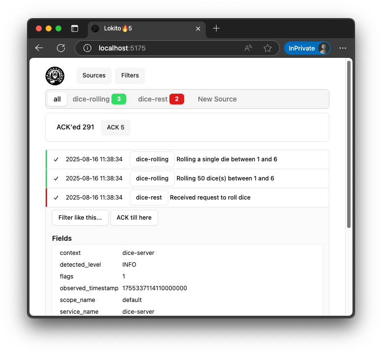
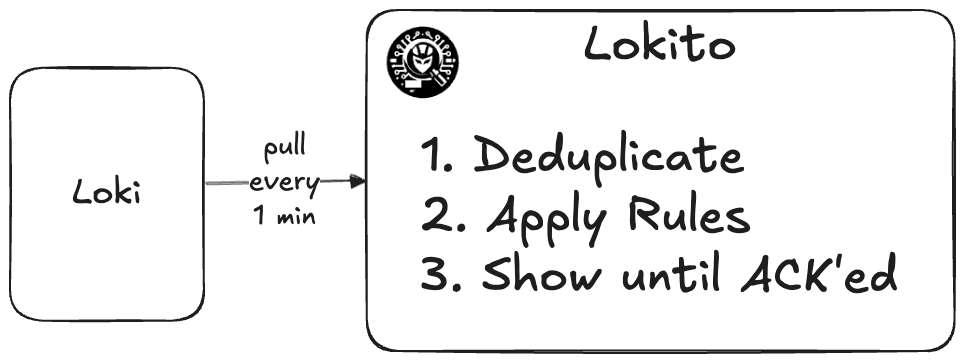

# Lokito - don't miss a single important line of log!

Lokito is a visual tool for keeping track of the logs from [loki](https://github.com/grafana/loki) . 

Think of a mailbox, where the messages are landing and staying until read and archived. With convenient filters/rules to auto-acknowledge the events of known type that don't require actions.

Lokito is not a replacement to the powers if [Grafana](https://github.com/grafana/grafana), but a complementary tool focused on a single task of finding deviation from the normal in otherwise noisy world of running own service on production. 



Technically, Lokito pulls logs for given loki `source`'s every minute into the browser's memory. The messages fetched are preserved while the window is open. The "sources" and "rules" are persisted in the browser's local storage.




# Configuration

Copy and adopt [test-config.js](./config/test-config.js). Point lokito to it by setting the `LOKITO_CONFIG_FILE` var in env or `.env`, e.g.: 

```
cp ./config/test-config.js ./config/my-test-config.js
echo 'LOKITO_CONFIG_FILE=./config/my-test-config.js'
> .env
```

🚫 Typescript not supported . 

[zod schema](src/config/config-schema.ts)

`id` required - how lokito would refer to this loki datasource

`alias` optional - alternative UI name of this datasource

`url` required, server-side only - the loki API endpoint to be proxied. Won't be exposed or used by the UI code.

`headers` optional, server-side only - allows to set additional headers to a proxied request, e.g. `x-grafana-org-id`.

# Start in preview mode

`npm run boot` - will check the latest code out, install the deps and start the preview server locally. 

# LGTM stack 

`docker run -p 3000:3000 -p3100:3100 -p 4317:4317 -p 4318:4318 --rm -ti grafana/otel-lgtm` as per [their blog](https://hub.docker.com/r/grafana/otel-lgtm)

Then run an [example](https://github.com/grafana/docker-otel-lgtm/tree/main/examples/nodejs)  : `curl "http://127.0.0.1:8084/rolldice?rolls=5"`

loki: `logcli query --from="2025-07-11T10:00:00Z" --output=jsonl '{service_name="dice-server"}' `